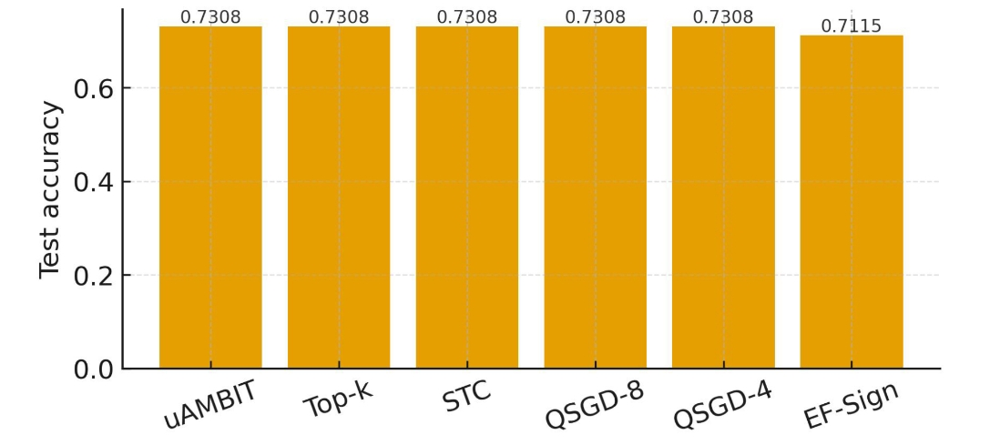
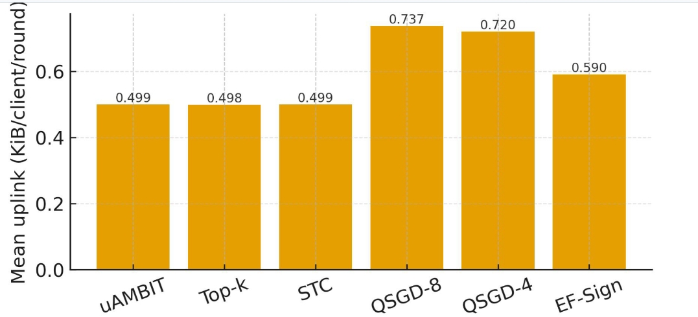

# UAMBIT: Hard-Cap Federated Compression with Predictable Uplink

[](https://colab.research.google.com/github/emadhammami/uambit-hard-cap-fl/blob/main/Untitled204.ipynb)

**One-liner:** Enforce a strict per-round uplink budget (KiB/client/round) in FL using threshold search + sign+single-scale quantization + error-feedback (single gzip payload). Predictable bytes with competitive accuracy.

---

## TL;DR results (BreastMNIST, 0.5 KiB cap)

| Method | Uplink (KiB) | Std (bytes) | Test Acc |
|---|---:|---:|---:|
| **UAMBIT (ours)** | **0.499** | **0.8** | **0.7308** |
| Top-k (budgeted) | 0.498 | 1.0 | 0.7308 |
| STC (budgeted) | 0.499 | 0.6 | 0.7308 |
| QSGD-8 | 0.737 | 2.3 | 0.7308 |
| QSGD-4 | 0.720 | 2.9 | 0.7308 |
| EF-Sign | 0.590 | 1.5 | 0.7115 |

**Figures (saved as files; browse all under [`src/results/`](./src/results)):**

<p align="center"> <a href="notebooks/budget050_acc.pdf">  </a> <a href="notebooks/budget050_uplink.pdf">  </a> </p>

---

## How this repo is organized

You’ll find **two views of the same experiment**:

### 1) Production-style (split modules)

- Core code under `src/uambit_cap/`:
  - `compressors.py` — uAMBIT, Top-k(DGC), STC, QSGD-8/4, EF-Sign
  - `model_data.py` — LeNet-5 (fixed pooling) + BreastMNIST loader
  - `experiment.py` — training loop, plotting, runners
  - `utils.py` — packing, flatten/unflatten, seeds, etc.
- Runner: `scripts/run_all.py` (writes figures).
- **Outputs (figures only):** `src/results/`.

**Why split it?**
- Clean separation of concerns → easier to review and reuse.
- Reproducible experiments via configs and callable runners.
- CV-friendly structure (modules, scripts, results folder).

### 2) Single notebook (“notbad” full view)

If you prefer a **single file** with **all code + printed logs**, use:

- **[`Untitled204.ipynb`](./Untitled204.ipynb)**

This notebook runs end-to-end and saves figures to `src/results/`.  
It prints a compact log slice (warnings + “Running …” lines) while keeping plots as files.

---

## Quickstart

### Colab
Open the badge above and run `Untitled204.ipynb`. Figures will be saved to `src/results/`.

### Local
```bash
pip install -r requirements.txt
python scripts/run_all.py
# figures will be written to: src/results/
